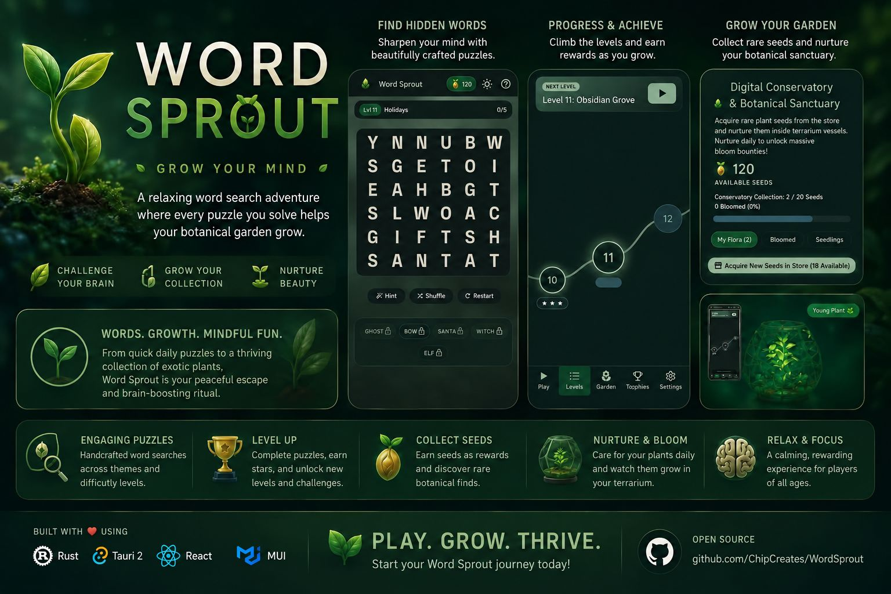

  

# Word Sprout

### 🌱 Grow Your Mind

A relaxing word search adventure where every puzzle you solve helps a botanical garden — and a whole greenhouse of progress — grow right alongside it. Challenge your brain, grow your collection, nurture something beautiful. Built as one codebase that runs natively on Windows, macOS, Linux, and Android, and installs straight from a browser tab everywhere else, including iOS.

## ▶ Play Now

### [chipcreates.github.io/WordSprout](https://chipcreates.github.io/WordSprout/) — zero install, works offline after the first visit

Prefer a native app? Grab the latest build for your platform:

| | | |
|---|---|---|
| 🪟 [**Windows**](../../releases/latest) | 🍎 [**macOS**](../../releases/latest) | 🐧 [**Linux**](../../releases/latest) |
| 🤖 [**Android**](../../releases/latest) | 📱 **iPhone/iPad** — see below ↓ | |

All native builds live on the [Releases page](../../releases/latest) — grab the file for your platform and OS version. Full install steps (and what to do about the "unknown publisher" warning you'll see, since none of this is code-signed) are in **[INSTALL.md](INSTALL.md)**.

#### Got an iPhone or iPad?

There's no App Store listing — Apple's Safari lets you install the web version as a real app instead, icon and all, with full offline play:

1. Open **[chipcreates.github.io/WordSprout](https://chipcreates.github.io/WordSprout/)** in **Safari** (this only works in Safari, not Chrome).
2. Tap the **Share** button (the square with an arrow pointing up).
3. Scroll down and tap **Add to Home Screen**.
4. Tap **Add** in the top-right corner.

Word Sprout now sits on your home screen with its own icon, opens full-screen with no browser chrome, and keeps working with the phone in airplane mode.

  

  

## Words. Growth. Mindful Fun.

From quick themed puzzles to a thriving collection of exotic plants, Word Sprout is a peaceful escape and a brain-boosting ritual in one — three ideas running through everything below: **challenge your brain**, **grow your collection**, **nurture beauty**.

### 🔍 Find hidden words

**44 hand-curated categories, and none of them get old.** Standard categories (Animals, Food, Sports, Horror Themes, Mythical Creatures) and 16 brutal Challenging ones (Chemistry, Legal Terms, Etymology, Cryptic/Obscure Adjectives) rotate as you level up. Boards grow from a friendly 4×4 up to a punishing 10×10 on Standard — 5×5 to 12×12 on Challenging — so the game keeps pace with how good you're getting instead of staying easy forever.

**Bonus words are hiding in plain sight, too.** The list on the side isn't the whole puzzle — drag out *any* real English word hiding in the grid, not just the ones asked for, and bank bonus Seeds for it. There are 125,312 of them to find, courtesy of the full ENABLE word list, so the board is a lot more generous than it looks.

**Stuck? Your tactical toolkit has you covered.** Seeds buy you out of trouble, not just around it:

| Power-up | What it does | Cost |
|---|---|---|
| 🔍 Single Letter Sprout | Reveals a target word's starting letter | 50 Seeds |
| 🌀 Lumina Cyclone | Reshuffles the board — progress stays intact | 100 Seeds |
| 🌱 Super Root Hint | Instantly reveals and solves an entire word | 250 Seeds |
| 🧭 Bioluminescent Compass | Points a directional guide at your next word | 350 Seeds |
| 🔬 Flora Spectrometer | Lights up every unfound word's starting cell | 500 Seeds |
| 🧪 Nitrogen Booster | Doubles Seed rewards for the rest of the level | 600 Seeds |

### 🏆 Progress & achieve

**Levels that actually celebrate you.** Clear one and the found words collapse into glowing dots, hold for a beat, then the whole board dissolves to reveal the category art underneath — closing with the action buttons gliding into place. It's a small thing. It still feels great every single time.

**13 achievements dare you to keep climbing.** From *Night Bloomer* (finish your very first level) to *Zenith Climber* (reach level 50) to the sneaky *Diagonal Detective* (find one single word placed on the diagonal), there's a badge tracking almost everything you do — visible any time from the trophy case.

### 🌿 Grow your garden

**The Moonlit Conservatory grows while you play.** Spend Seeds on any of **20 plants**, spanning seven rarity tiers from *Common* moss up to a single *Cosmic* Ficus that'll run you 20,000 Seeds. Water each one every two hours to advance growth, or pay a scaled fertilizer cost to skip the wait — once a plant hits full bloom it pays a partial rebate, from 50 Seeds for the free starter Moss Sprout to half the purchase cost for purchased plants. It's a collection goal running quietly underneath the word search.

**The Seed Store is worth saving up for.** Beyond power-ups and plants, Seeds unlock two full cosmetic environment themes — the amber **Autumn Canopy** and the deep-sea **Ocean Trench** — plus an exclusive glowing **Golden Sprout Crest** for your botanist profile, for players willing to grind to the top.

### 🧘 Relax & focus, anywhere

Underneath the collecting and the climbing, Word Sprout is still just a calming word search — the kind of thing you open for two minutes and stay with for twenty. The web build is a fully installable, offline-capable PWA, and real native apps cover Windows, macOS, Linux, and Android besides — so there's no platform, and no five minutes of downtime, where you can't pick it back up.

---

**Play. Grow. Thrive.** Building it yourself, or want the full technical rundown of how one codebase ships to five platforms? That's all in **[INSTALL.md](INSTALL.md)**.
