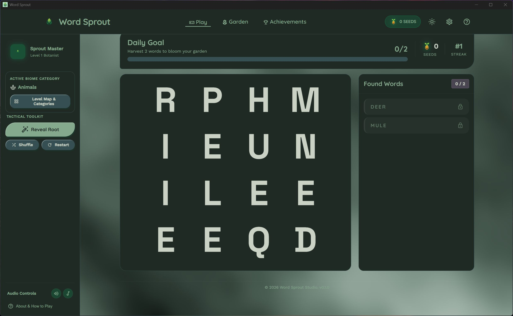
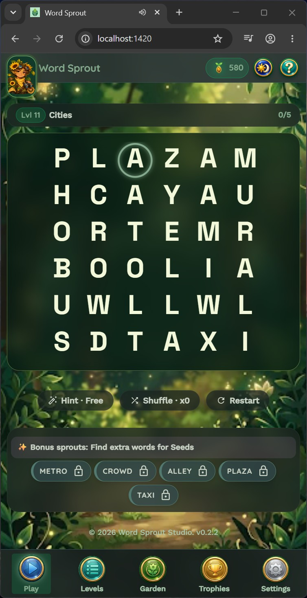

# Word Sprout

A themed word search game built with Tauri, React, and Rust — desktop app, Android app, and installable web app, all from one codebase.

**[Play it now in your browser →](https://chipcreates.github.io/WordSearch/)**

<p>
  
</p>
<p>
  
</p>

## Features

- **10 themed categories** — Animals, Food, Nature, Weather, Ocean, Space, Sports, Household, Transportation, Music — each with its own curated word list and matching background art. Categories cycle as you level up.
- **Progressive difficulty** — the grid grows from 4×4 to 10×10 as you climb levels, with the word count scaling to match (modeled on real word-search games like Vita Word Search rather than an arbitrary curve).
- **Bonus words** — dragging out any real English word placed in the grid, not just the ones on the list, earns a bonus star. Backed by a 60,656-word dictionary.
- **10 achievements** — level-count and star milestones, seeing every category, and a "Diagonal Detective" badge for finding a diagonally-placed word — tracked persistently and viewable from a trophy button in the header.
- **Level-complete celebration** — found-word highlights collapse into dots, hold on screen, then the board fades to reveal the category art behind it, closing with the action buttons gliding to the center of the window.
- **Installable PWA** — the web build works fully offline after the first visit (service worker precaches the app, background art, and dictionary) and installs to a phone or Mac's home screen/dock like a native app.

## Play it

| Platform | How |
|---|---|
| **Web** | Open **[chipcreates.github.io/WordSearch](https://chipcreates.github.io/WordSearch/)** in any modern browser. On iPhone/Mac Safari, use Share → "Add to Home Screen" for a full-screen, offline-capable app. |
| **Desktop** | Download a prebuilt binary from [Releases](../../releases/latest) — Linux, Windows, macOS — or build from source (see below). |
| **Android** | Download the APK from [Releases](../../releases/latest), or build from source (see below). |

## How to install and run

Prebuilt binaries for every tagged version are published automatically to the [Releases page](../../releases/latest) by [`.github/workflows/release.yml`](.github/workflows/release.yml). These aren't signed by an Apple/Microsoft developer certificate, so the OS will show an "unknown publisher" warning the first time you open one — that's expected for a self-published indie app, not a sign of tampering.

| Platform | File | Steps |
|---|---|---|
| **Windows** | `.msi` or `-setup.exe` | Run the installer. If SmartScreen blocks it, click **More info → Run anyway**. |
| **macOS** | `.dmg` | Open the `.dmg` and drag Word Sprout to Applications. Gatekeeper will refuse to open an unsigned app on the first launch — right-click the app → **Open** → **Open** again to confirm, or run `xattr -d com.apple.quarantine "/Applications/Word Sprout.app"` in Terminal. |
| **Linux** | `.AppImage` | `chmod +x Word-Sprout_*.AppImage && ./Word-Sprout_*.AppImage` |
| **Linux (Debian/Ubuntu)** | `.deb` | `sudo dpkg -i word-sprout_*.deb` |
| **Android** | `.apk` | Download on-device (or transfer over), tap the file, and allow "install from unknown sources" for your browser/file manager when prompted. |

## Tech stack

- **Frontend**: React 19, TypeScript, Vite, MUI (Material UI)
- **Desktop/Android shell**: [Tauri v2](https://tauri.app/) — Rust backend, native webview
- **Rendering**: the letter grid and celebration animation are hand-drawn on `<canvas>`, not DOM elements
- **Web build**: a separate Vite config/target (`vite.web.config.ts`) with [vite-plugin-pwa](https://vite-pwa-org.netlify.app/) for the service worker and manifest — deployed to GitHub Pages via GitHub Actions on every push to `master`

### One codebase, three targets

The Tauri desktop/Android app gets puzzle words and bonus-word validation from Rust (`src-tauri/src/categories.rs`, `dictionary.rs`) over IPC. The web build has no Tauri runtime to call into, so [`src/backend.ts`](src/backend.ts) picks between the real IPC call and a local-JS equivalent at runtime, based on whether the Tauri bridge is actually present. `public/dictionary.json` and `src/webCategories.json` are generated directly from the Rust source, not hand-transcribed, so the web build's word lists stay in exact sync with what the native apps ship.

## Building from source

### Prerequisites

- [Node.js](https://nodejs.org/) 20+
- [Rust](https://www.rust-lang.org/tools/install) (stable toolchain)
- [Tauri prerequisites](https://tauri.app/start/prerequisites/) for your platform
- For Android: [Android Studio](https://developer.android.com/studio) (SDK + NDK) and a configured `ANDROID_HOME`/`NDK_HOME`

```bash
npm install
```

### Desktop

```bash
npm run tauri dev      # dev, with hot reload
npm run tauri build    # production build
```

### Android

```bash
npm run tauri android dev              # dev, on an emulator or connected device
npm run tauri android build -- --debug # debug APK
npm run tauri android build            # release build
```

### Web (PWA)

A separate build target from the Tauri app — same game, no Tauri runtime required.

```bash
npm run build:web      # outputs to dist-web/
npm run preview:web    # serve the production build locally
```

Pushes to `master` that touch the app automatically rebuild and redeploy the web build to GitHub Pages via [`.github/workflows/deploy-web.yml`](.github/workflows/deploy-web.yml).

## Credits

Category background art sourced from Pixabay — see [`public/backgrounds/CREDITS.md`](public/backgrounds/CREDITS.md) for full attribution.
